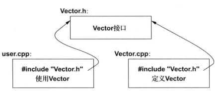

# 常量

## const 与 constexpr

C++支持如下两种不变性概念：

- const：意为“<font color="red">承诺不会改变某个值</font>”。

  主要用于说明接口，因此不用担心在把变量传入函数时，该变量会在函数内被改变。

  编译器会负责确认并执行const的承诺。

- constexpr：意为“<font color="red">在编译时求值</font>”。

  主要用于说明常量，作用是允许将数据至于只读内存中，以提升性能。


## constexpr函数

如果某个函数，被用在常量表达式中，即该表达式需要在编译时求值，则函数必须被定义为constexpr。例如：

```C++
constexpr double max = 1.4*square(17);
constexpr double square(double x){
    return x*x；
}
```

定义为constexpr的函数，有如下要求：

- 函数中只能有一条用于计算某个值的return语句


constexpr函数，还可以接收非常量实参，但此时其结果不再是一个常量表达式：
```C++
constexpr int double_num(int x) {
	return x * 2;
}
int x1 = double_num(2);	// x1是普通变量
constexpr int x2 = double_num(2);	// x2是常量表达式
```


# 声明

## 声明运算符

当用于声明语句时，如下运算符，被称为声明运算符：

- `&`
- `*`
- `[]`


# 类型

## 内置类型

通过以下三种要素，构造出的类型，称为内置类型：

- 基本类型
- const修饰符
- 声明运算符


## 结构体struct

```C++
struct Vector{
  	int sz;
    double *elem;
};

Vector v;
v.sz = 100;
```


## 类class

类含有一系列成员：

- 数据
- 函数
- **类型**

```C++
class Vector{
private:
	int sz;
    double* elem;

public:
    Vector(int s) : elem{new double[s]}, sz{s} {}
    double& operator[](int i){return elem[i];}
}
```


## 枚举enum

```C++
enum class Color {red, blue, green};

Color col = Color::red;
int i = Color::red;	// 错误：Color::red不是一个int
Color c = 2;	// 错误：2不是一个Color::red
```


如果希望枚举值可以和int进行隐式转换，则应定义为`enum`：
```C++
enum class Color {red, blue, green};

int i = Color::red;	// i为0
```


# 模块化

一个C++程序，可能包含许多独立开发的部分：

- 函数
- 用户自定义类型
- 类层次
- 模板


在语言层面，C++使用声明来描述接口，使用定义来进行实现。

- 声明，指定了使用某个函数或某种类型所需的所有东西。
- 定义。


## 分离编译

用户代码，只能看见所用类型和函数的声明，它们的定义则放置在分离的源文件中，并被分别编译。




user.cpp和Vecotr.cpp中的代码共享Vector.h提供的Vector接口信息，但这两个文件是相互独立的，可以被分离编译。


## 名称空间

用于避免与其他名称空间中的 函数、类等发生冲突。


# 错误处理

运行时错误的捕获位置，与错误处理的位置可以分离被分离开来。


## 异常

当我们试图访问某个越界元素时，应该做些什么?

- Vector的作者，并不知道使用者希望如何处理这种情况
- Vecotr的使用者，并不知道什么情况下会出现访问越界

因此最佳的解决方式是：

- 由Vector的实现者，负责检测可能的越界访问，然后通知使用者。
- 之后Vector的使用者，可以采取适当的应对措施。

```C++
double& operator[](int i){
    if(i<0 || size()<=i) throw out_of_range("Vector::operator[]");
    
    return elem[i];
}
```

`throw`负责将程序的控制权，从某个直接或间接调用该函数的函数，转移到out_of_range异常处理代码。


## 不变式

- 不变式的定义：

  对于类来说，假定某事为真的声明，成为类的不变式。

  > 例如：elem元素指向一个含有sz个double的数组。

- 建立类的不变式，是构造函数的任务，从而成员函数可以依赖于该不变式。


不变式的概念是设计类的关键，而前置条件也在设计函数的过程中起到同样的作用。

不变式：

- 帮助我们准确地理解想要什么
- 强制要求具体而明确地描述设计。这有利于确保代码正确。


## 静态断言

- 程序异常，负责**在运行时**报告发生的错误。

- 通过静态断言，也可以在编译时对可知的属性进行一些简单检查，并以编译器错误信息的形式报告所发生的问题。

  ```C++
  static_assert(4 <= sizeof(int), "integers are too small"); // 检查int的尺寸
  ```


`static_assert`机制，能用于任何可以表达为常量表达式的东西。


