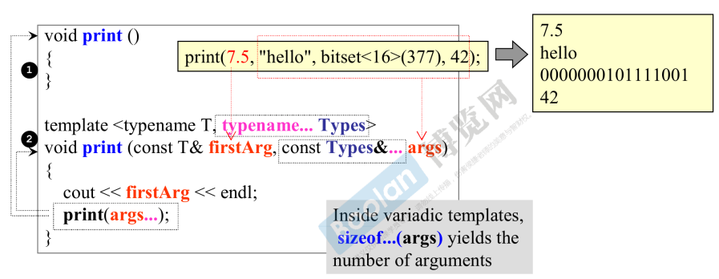
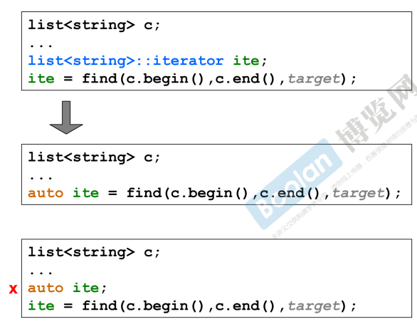
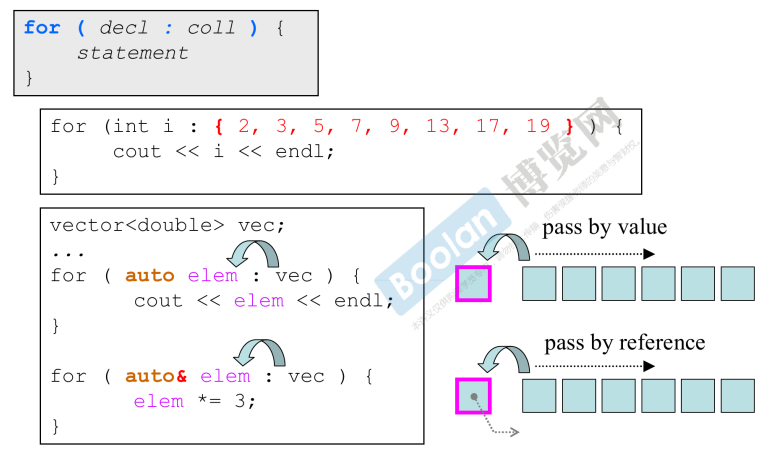

[百度网盘 - 视频播放 (baidu.com)](https://pan.baidu.com/play/video#/video?path=%2F第二套、侯捷老师全系列八部曲 - 手把手教你进阶系列%2F01 - 侯捷 - C%2B%2B面向对象高级开发（上下两部曲）%2F02、C%2B%2B面向对象高级编程（下）%2F关于C%2B%2B标准库 13.mp4&t=13)

# 数量不定的模板参数(variadic templates)



> `...`即为所谓的`pack（包）`：
>
> - 用于template paramters：称为template parameters pack（模板参数包）
> - 用于function paramter types：称为function paramter types pack（函数参数类型包）
> - 用于function paramters：称为function parameters pack（函数参数包）


```C++
#include <iostream>
#include <bitset>

void print(){}

template<typename T, typename... Types>
void print(const T &firstArg, const Types &... args) {
    std::cout << firstArg << std::endl;

    print(args...);
}


int main() {
    print(7.5, "hello", std::bitset<16>(377), 42);

    return 0;
}
```


# auto

使用auto关键字，根据表达式推断变量类型：




# range-based for

