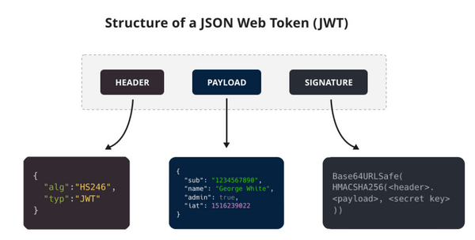
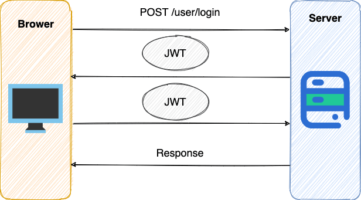

# JWT的组成



JWT 本质上就是一组字串，通过（`.`）切分成三个为 Base64 编码的部分：

- **Header** : 描述 JWT 的元数据，定义了生成签名的算法以及 `Token` 的类型。
- **Payload** : 用来存放实际需要传递的数据
- **Signature（签名）** ：服务器通过 Payload、Header 和一个密钥(Secret)使用 Header 里面指定的签名算法（默认是 HMAC SHA256）生成。


JWT 通常是这样的：`xxxxx.yyyyy.zzzzz`。

示例：

```
eyJhbGciOiJIUzI1NiIsInR5cCI6IkpXVCJ9.
eyJzdWIiOiIxMjM0NTY3ODkwIiwibmFtZSI6IkpvaG4gRG9lIiwiaWF0IjoxNTE2MjM5MDIyfQ.
SflKxwRJSMeKKF2QT4fwpMeJf36POk6yJV_adQssw5c
```

你可以在 [jwt.io](https://gitee.com/link?target=https%3A%2F%2Fjwt.io%2F) 这个网站上对其 JWT 进行解码，解码之后得到的就是 Header、Payload、Signature 这三部分。

Header 和 Payload 都是 JSON 格式的数据，Signature 由 Payload、Header 和 Secret(密钥)通过特定的计算公式和加密算法得到。


## Header

Header 通常由两部分组成：

- `typ`（Type）：令牌类型，也就是 JWT。
- `alg`（Algorithm） ：签名算法，比如 HS256。

```json
{
  "alg": "HS256",
  "typ": "JWT"
}
```

JSON 形式的 Header 被转换成 Base64 编码，成为 JWT 的第一部分。


## Payload

Payload 也是 JSON 格式数据，其中包含了 Claims(声明，包含 JWT 的相关信息)。


Claims 分为三种类型：

- **Registered Claims（注册声明）** ：预定义的一些声明，建议使用，但不是强制性的。
- **Public Claims（公有声明）** ：JWT 签发方可以自定义的声明，但是为了避免冲突，应该在 [IANA JSON Web Token Registry](https://gitee.com/link?target=https%3A%2F%2Fwww.iana.org%2Fassignments%2Fjwt%2Fjwt.xhtml) 中定义它们。
- **Private Claims（私有声明）** ：JWT 签发方因为项目需要而自定义的声明，更符合实际项目场景使用。

下面是一些常见的注册声明：

- `iss`（issuer）：JWT 签发方。
- `iat`（issued at time）：JWT 签发时间。
- `sub`（subject）：JWT 主题。
- `aud`（audience）：JWT 接收方。
- `exp`（expiration time）：JWT 的过期时间。
- `nbf`（not before time）：JWT 生效时间，早于该定义的时间的 JWT 不能被接受处理。
- `jti`（JWT ID）：JWT 唯一标识。


```json
{
  "uid": "ff1212f5-d8d1-4496-bf41-d2dda73de19a",
  "sub": "1234567890",
  "name": "John Doe",
  "exp": 15323232,
  "iat": 1516239022,
  "scope": ["admin", "user"]
}
```

Payload 部分默认是不加密的，**一定不要将隐私信息存放在 Payload 当中！！！**


## Signature

Signature 部分是对前两部分的签名，作用是防止 JWT（主要是 payload） 被篡改。


这个签名的生成需要用到：

- Header + Payload。
- 存放在服务端的密钥(一定不要泄露出去)。
- 签名算法。


签名的计算公式如下：

```
HMACSHA256(
  base64UrlEncode(header) + "." +
  base64UrlEncode(payload),
  secret)
```

算出签名以后，把 Header、Payload、Signature 三个部分拼成一个字符串，每个部分之间用"点"（`.`）分隔，这个字符串就是 JWT 。


# 如何基于JWT进行身份验证

在基于 JWT 进行身份验证的的应用程序中，服务器通过 Payload、Header 和 Secret(密钥)创建 JWT 并将 JWT 发送给客户端。客户端接收到 JWT 之后，会将其保存在 Cookie 或者 localStorage 里面，以后客户端发出的所有请求都会携带这个令牌。




简化后的步骤如下：

1. 用户向服务器发送用户名、密码以及验证码用于登陆系统。
2. 如果用户用户名、密码以及验证码校验正确的话，服务端会返回已经签名的 Token，也就是 JWT。
3. 用户以后每次向后端发请求都在 Header 中带上这个 JWT 。
4. 服务端检查 JWT 并从中获取用户相关信息。

>1. 建议将 JWT 存放在 localStorage 中，放在 Cookie 中会有 CSRF 风险。
>2. 请求服务端并携带 JWT 的常见做法是将其放在 HTTP Header 的 `Authorization` 字段中（`Authorization: Bearer Token`）。


# demo

**[spring-security-jwt-guide](https://gitee.com/link?target=https%3A%2F%2Fgithub.com%2FSnailclimb%2Fspring-security-jwt-guide)** 就是一个基于 JWT 来做身份认证的简单案例。


## 