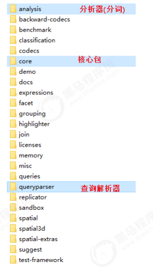
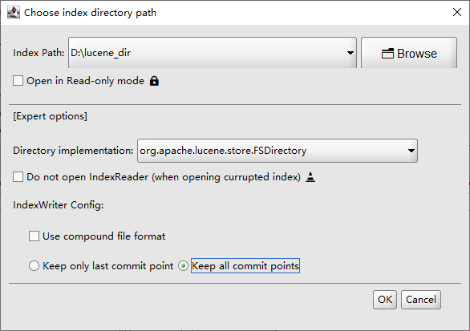

# 相关资料

- [链接](https://www.bilibili.com/video/BV1eJ411q7nw?p=7)


# Lucene入门

## 准备

- 资料：lucene.zip

- 核心文件：

  


## 创建项目

maven项目，pom.xml如下：
```xml
<parent>
    <groupId>org.springframework.boot</groupId>
    <artifactId>spring-boot-starter-parent</artifactId>
    <version>2.1.4.RELEASE</version>
</parent>
<dependencies>
    <dependency>
        <groupId>commons-io</groupId>
        <artifactId>commons-io</artifactId>
        <version>2.6</version>
    </dependency>
    <dependency>
        <groupId>org.apache.lucene</groupId>
        <artifactId>lucene-core</artifactId>
        <version>7.7.2</version>
    </dependency>
    <dependency>
        <groupId>org.apache.lucene</groupId>
        <artifactId>lucene-analyzers-common</artifactId>
        <version>7.7.2</version>
    </dependency>
    <dependency>
    <groupId>org.apache.lucene</groupId>
    <artifactId>lucene-queryparser</artifactId>

    </dependency>
    <!-- 测试 -->
    <dependency>
        <groupId>junit</groupId>
        <artifactId>junit</artifactId>
        <version>4.12</version>
        <scope>test</scope>
    </dependency>
    <!-- mysql数据库驱动 -->
    <dependency>
        <groupId>mysql</groupId>
        <artifactId>mysql-connector-java</artifactId>
        <version>5.1.48</version>
    </dependency>
    <!-- IK中文分词器 -->
    <dependency>
        <groupId>org.wltea.ik-analyzer</groupId>
        <artifactId>ik-analyzer</artifactId>
        <version>8.1.0</version>
    </dependency>
    <!--web起步依赖-->
    <dependency>
        <groupId>org.springframework.boot</groupId>
        <artifactId>spring-boot-starter-web</artifactId>
    </dependency>
    <!-- 引入thymeleaf -->
    <dependency>
        <groupId>org.springframework.boot</groupId>
        <artifactId>spring-boot-starter-thymeleaf</artifactId>
    </dependency>
    <!-- Json转换工具 -->
    <dependency>
        <groupId>com.alibaba</groupId>
        <artifactId>fastjson</artifactId>
        <version>1.2.51</version>
    </dependency>
</dependencies>
```


## 创建索引库

1. 采集数据
2. 创建文档对象
3. 创建分词器对象
4. 创建Directory对象（用于表示索引库位置）
5. 创建IndexWriterConfig对象（用于指定切分词使用的分词器）
6. 创建IndexWriter输出流对象（用于指定输出的位置和使用的Config初始化对象）
7. 写入文档到索引库
8. 释放资源


```java
import org.apache.lucene.analysis.Analyzer;
import org.apache.lucene.analysis.standard.StandardAnalyzer;
import org.apache.lucene.document.Document;
import org.apache.lucene.document.Field;
import org.apache.lucene.document.TextField;
import org.apache.lucene.index.IndexWriter;
import org.apache.lucene.index.IndexWriterConfig;
import org.apache.lucene.store.Directory;
import org.apache.lucene.store.FSDirectory;
import org.example.dao.SkuDao;
import org.example.dao.SkuDaoImpl;
import org.example.pojo.Sku;
import org.junit.Test;

import java.io.IOException;
import java.nio.file.Paths;
import java.util.ArrayList;
import java.util.List;

public class TestIndexManager {

    /*
     * 创建索引库：
     * 1. 采集数据
     * 2. 创建文档对象
     * 3. 创建分词器对象
     * 4. 创建Directory对象（用于表示索引库位置）
     * 5. 创建IndexWriterConfig对象（用于指定切分词使用的分词器）
     * 6. 创建IndexWriter输出流对象（用于指定输出的位置和使用的Config初始化对象）
     * 7. 写入文档到索引库
     * 8. 释放资源
     * */
    @Test
    public void createIndexTest() throws IOException {
        SkuDao skuDao = new SkuDaoImpl();
        List<Sku> skuList = skuDao.querySkuList();

        List<Document> docList = new ArrayList<>();
        skuList.forEach(sku -> {
            Document document = new Document();

            //创建域对象
            document.add(new TextField("id", sku.getId(), Field.Store.YES));
            document.add(new TextField("name", sku.getName(), Field.Store.YES));
            document.add(new TextField("price", String.valueOf(sku.getPrice()), Field.Store.YES));
            document.add(new TextField("image", sku.getImage(), Field.Store.YES));
            document.add(new TextField("categoryName", sku.getCategoryName(), Field.Store.YES));
            document.add(new TextField("brandName", sku.getBrandName(), Field.Store.YES));

            docList.add(document);
        });

        // 标准分词器，对中文按单字分词
        Analyzer analyzer = new StandardAnalyzer();
        Directory dir = FSDirectory.open(Paths.get("D:\\lucene_dir"));
        IndexWriterConfig config = new IndexWriterConfig(analyzer);
        IndexWriter indexWriter = new IndexWriter(dir, config);

        docList.forEach(doc -> {
            try {
                indexWriter.addDocument(doc);
            } catch (IOException e) {
                e.printStackTrace();
            }
        });

        indexWriter.close();
    }
}
```


## 查看索引库文件内容

使用Luke查看




## 搜索过程

```java
import org.apache.lucene.analysis.Analyzer;
import org.apache.lucene.analysis.standard.StandardAnalyzer;
import org.apache.lucene.document.Document;
import org.apache.lucene.index.DirectoryReader;
import org.apache.lucene.index.IndexReader;
import org.apache.lucene.queryparser.classic.ParseException;
import org.apache.lucene.queryparser.classic.QueryParser;
import org.apache.lucene.search.IndexSearcher;
import org.apache.lucene.search.Query;
import org.apache.lucene.search.ScoreDoc;
import org.apache.lucene.search.TopDocs;
import org.apache.lucene.store.Directory;
import org.apache.lucene.store.FSDirectory;
import org.junit.Test;

import java.io.IOException;
import java.nio.file.Paths;

public class TestSearch {


    /*
     * 测试搜索过程：
     * 1. 创建分词器（对搜索关键词进行分词）
     * 2. 创建查询对象
     * 3. 设置搜索关键词
     * 4. 创建Directory对象（指定索引库位置）
     * 5. 创建输入流对象
     * 6. 创建搜索对象
     * 7. 搜索，并返回结果
     * 8. 获取结果集
     * 9. 关闭资源
     * */
    @Test
    public void testIndexSearch() throws ParseException, IOException {
        Analyzer analyzer = new StandardAnalyzer();

        QueryParser queryParser = new QueryParser("name", analyzer); // 默认查询域
        Query query = queryParser.parse("华为手机");//设置查询条件

        Directory dir = FSDirectory.open(Paths.get("D:\\lucene_dir"));
        IndexReader indexReader = DirectoryReader.open(dir);
        IndexSearcher indexSearcher = new IndexSearcher(indexReader);
        TopDocs topDocs = indexSearcher.search(query, 10);// 分页返回10条数据

        // 处理结果集
        for (ScoreDoc scoreDoc : topDocs.scoreDocs) {
            int docID = scoreDoc.doc;
            Document doc = indexSearcher.doc(docID);
            System.out.println("-------------------------------------------------------------");
            System.out.println("id:"+doc.get("id"));
            System.out.println("name:"+doc.get("name"));
            System.out.println("price:"+doc.get("price"));
            System.out.println("image:"+doc.get("image"));
            System.out.println("brandName:"+doc.get("brandName"));
            System.out.println("categoryName:"+doc.get("categoryName"));
        }

        long totalHits = topDocs.totalHits; //结果集总数
    }
}
```


# Field

## Field属性

Field是文档中的域，包括Field名和Field值两部分，一个文档可以包括多个Field，Document只是Field 的一个承载体，Field值即为要索引的内容，也是要搜索的内容。

- 是否分词(tokenized)

  - 是：作分词处理，即将Field值进行分词，分词的目的是为了索引。

    比如：商品名称、商品描述等，这些内容用户要输入关键字搜索，由于搜索的内容格式大、内容多需要分词后将语汇单元建立索引

  - 否：不作分词处理

    比如：商品id、订单号、身份证号等

- 是否索引(indexed)

  - 是：进行索引。将Field分词后的词或整个Field值进行索引，存储到索引域，索引的目的是为了搜索。

    比如：商品名称、商品描述分析后进行索引，订单号、身份证号不用分词但也要索引，这些将来都要作 为查询条件。

  - 否：不索引。

    比如：图片路径、文件路径等，不用作为查询条件的不用索引。

- 是否存储(stored)

  - 是：将Field值存储在文档域中，存储在文档域中的Field才可以从Document中获取。

    比如：商品名称、订单号，凡是将来要从Document中获取的Field都要存储。

  - 否：不存储Field值

    比如：商品描述，内容较大不用存储。如果要向用户展示商品描述可以从系统的关系数据库中获取。


## Field常用类型

| Filed类型                                                    | 数据类型                  | 是否分词(tokenized) | 是否索引(indexed) | 是否存储(stored) | 说明                                                         |
| ------------------------------------------------------------ | ------------------------- | ------------------- | ----------------- | ---------------- | ------------------------------------------------------------ |
| StringField(FieldName, FieldValue,Store.YES))                | 字符串                    | N                   | Y                 | Y或N             | 这个Field用来构 建一个字符串 Field，但是不会 进行分词，会将 整个串存储在索 引中，比如(订单 号,身份证号等) 是否存储在文档 中用Store.YES或 Store.NO决定 |
| FloatPoint(FieldName, FieldValue)                            | Float型                   | Y                   | Y                 | N                | 这个Field用来构 建一个Float数字 型Field，进行分 词和索引，不存 储, 比如(价格) 存 储在文档中 |
| DoublePoint(FieldName, FieldValue)                           | Double 型                 | Y                   | Y                 | N                | 这个Field用来构 建一个Double数 字型Field，进行 分词和索引，不 存储 |
| LongPoint(FieldName, FieldValue)                             | Long型                    | Y                   | Y                 | N                | 这个Field用来构 建一个Long数字 型Field，进行分 词和索引，不存 储 |
| IntPoint(FieldName, FieldValue)                              | Integer 型                | Y                   | Y                 | N                | 这个Field用来构 建一个Integer数 字型Field，进行 分词和索引，不 存储 |
| StoredField(FieldName, FieldValue)                           | 重载方 法，支 持多种 类型 | N                   | N                 | Y                | 这个Field用来构 建不同类型Field 不分析，不索 引，但要Field存 储在文档中 |
| TextField(FieldName, FieldValue, Store.NO) 或 TextField(FieldName, reader) | 字符串 或 流              | Y                   | Y                 | Y或N             | 如果是一个 Reader, lucene 猜测内容比较多, 会采用Unstored 的策略. |
| NumericDocValuesField(FieldName, FieldValue)                 | 数值                      | -                   | -                 | -                | 配合其他域排序 使用                                          |


# 维护索引库

## 创建索引

调用 indexWriter.addDocument（doc）添加索引。


## 修改索引

更新索引是先删除再添加：

- 先查询，若存在则进行更新
- 若不存在则新增

```java
@Test
public void testIndexUpdate() throws Exception {
    // 创建分词器
    Analyzer analyzer = new StandardAnalyzer();
    // 创建Directory流对象
    Directory directory = FSDirectory.open(Paths.get("E:\\dir"));
    // 创建IndexWriteConfig对象，写入索引需要的配置
    IndexWriterConfig config = new IndexWriterConfig(analyzer);
    // 创建写入对象
    IndexWriter indexWriter = new IndexWriter(directory, config);
    // 创建Document
    Document document = new Document();
    document.add(new TextField("id", "1202790956", Field.Store.YES));
    document.add(new TextField("name", "lucene测试test 002", Field.Store.YES));
    // 执行更新，会把所有符合条件的Document删除，再新增。
    indexWriter.updateDocument(new Term("id", "1202790956"), document);
    indexWriter.close();
}
```


## 删除索引

根据Term项删除索引，满足条件的将全部删除。

```java
@Test
public void testIndexDelete() throws Exception {
    // 创建分词器
    Analyzer analyzer = new StandardAnalyzer();
    // 创建Directory流对象
    Directory directory = FSDirectory.open(Paths.get("E:\\dir"));
    // 创建IndexWriteConfig对象，写入索引需要的配置
    IndexWriterConfig config = new IndexWriterConfig(analyzer);
    // 创建写入对象
    IndexWriter indexWriter = new IndexWriter(directory, config);
    // 根据Term删除索引库，name:java
    indexWriter.deleteDocuments(new Term("id", "998188"));
    // 释放资源
    indexWriter.close();
}
```

> 执行删除索引后，索引域没有变化。文档域数据被删除掉


# 分词器

[黑马程序员Lucene全文检索技术，从底层到实战应用Lucene全套教程_哔哩哔哩_bilibili](https://www.bilibili.com/video/BV1eJ411q7nw?p=18)