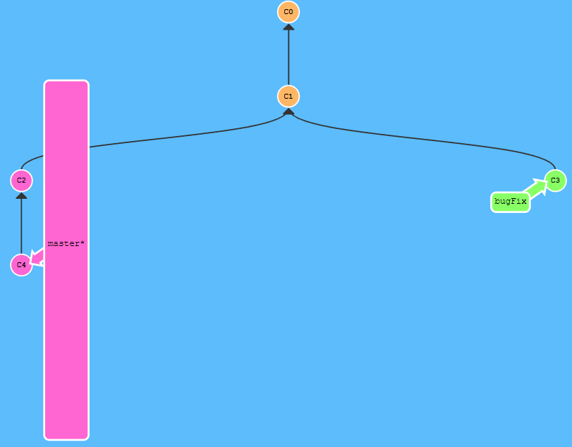
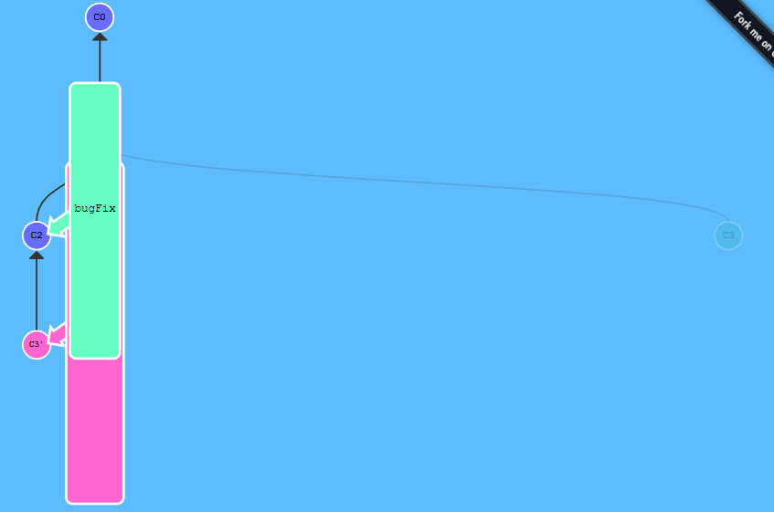
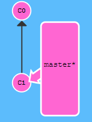

# 相关资料

- [教程](https://oschina.gitee.io/learn-git-branching/)


# git主要命令

## git commit

- 在**本地仓库的当前分支**，提交记录


## git branch \<name>

```sh
git branch newImage
```

意为：创建新分支，其名为newImage

> 注意：切换分支之后，当前分支与新分支在同一个提交节点上。


## git checkout \<name>

```sh
git checkout  newImage
```

意为：切换到名为newImage的分支


> 简洁方式：创建新分支，并切换过去：
>
> ```sh
> git checkout -b <branch-name>
> ```
>
> 


## git merge \<branch-name>

例如：现在有两个branch：

- master：目前位于master
- bugFix



执行该命令后，master节点向前推进，结果节点的将存在两个父节点

```sh
git merge bugFix
```


## git rebase \<branch-name>

- Rebase 实际上就是取出一系列的提交记录，“复制”它们，然后在另外一个地方逐个的放下去。
- Rebase 的优势就是可以创造更线性的提交历史，这听上去有些难以理解。如果只允许使用 Rebase 的话，代码库的提交历史将会变得异常清晰。


执行之前，存在两个分支：

- master：目前位于master
- bugFix


```sh
git rebase bugFix
```

执行该命令后，master移动到bugFix下面，结果节点仅存在一个父节点bugFix




# 在提交树上移动

- `HEAD`：是一个对当前检出记录的符号引用 —— 也就是指向你正在其基础上进行工作的提交记录

  - 通常情况下，HEAD指向分支名（例如master），分支名再指向具体的提交记录

  - 通过`git checkout <具体提交记录>`，可将HEAD从分支名中分离：

    - 执行之前：

      

    - 执行之后：

      ```sh
      git checkout c1
      ```

      