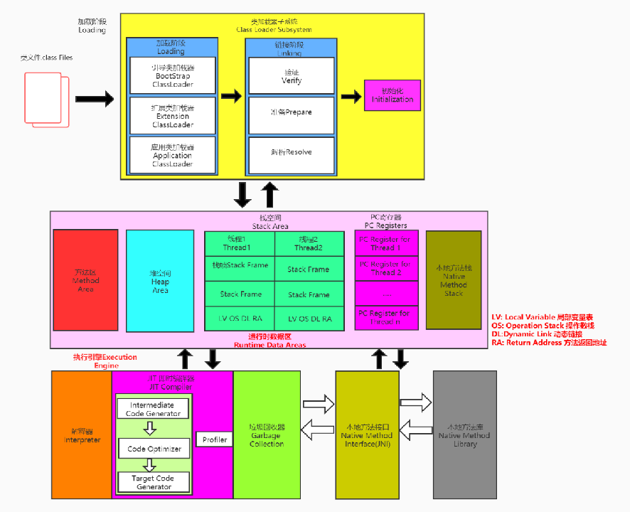
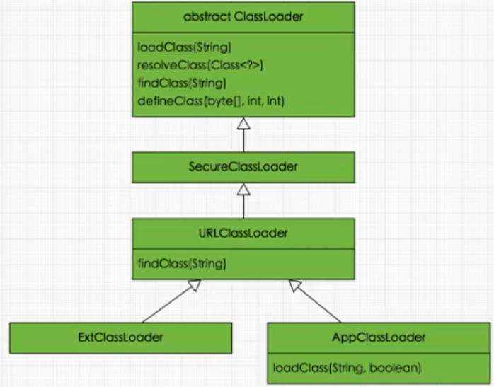

# 类加载子系统概述




类加载器子系统，负责从文件系统或网络中加载class文件。

ClassLoader只负责class文件的加载，至于它是否可以执行，则由ExecutionEngine决定。


加载的类信息，存放在逻辑上称为==方法区==的内存空间。

> 方法区还存放：
>
> - 运行时常量池信息
> - 字符串字面值
> - 数字常量
>
> 这部分的常量，是Class文件中常量池部分的<u>内存映射</u>


# 类加载器与类的加载过程

类加载的过程：

1. 加载(Loading)
2. 验证(Verification)
3. 准备(Preparation)
4. 解析(Resolution)
5. 初始化(Initializaiton)

> 中间三步，可以合称为链接(Linking)


## 加载(Loading)

1. 通过一个类的==全限定名==，获取定义了此类的二进制字节流

2. 将这个字节流所代表的==静态存储结构==，转换为方法区的==运行时数据结构==

    > 在JDK7及以前，方法区实际存储在永久代；
    >
    > 之后存储在元空间

3. ==在内存中生成一个代表这个类的`java.lang.Class`对象==，作为方法区这个类的各种数据的访问入口


class文件，可以来源于：

- 本地系统
- 网络，典型的如Web Applet
- 从ZIP压缩包中读取，日后JAR、WAR格式的基础
- 运行时计算生成，典型的有动态代理技术
- 从其他文件生成，如JSP应用


> Loading阶段，最主要的就是==生成class对象==到方法区中


## 链接(Linking)

https://www.bilibili.com/video/BV1PJ411n7xZ?p=29

- 验证(Verify)：

    - 目的是确保class文件的字节流中包含的信息，满足虚拟机要求，保证被加载类的正确性，不会危害虚拟机自身安全。

    - 主要包含：文件格式验证、元数据验证、字节码验证、符号引用验证

        > 字节码文件以魔数CAFE BABE开头

- 准备(Prepare)

    - 为==类变量(static变量)分配内存，并且设置该类变量的默认初始值（即零值）==。直到初始化阶段，类变量才被赋目标值。

        > ***被final修饰的static变量，在准备阶段就会被显式初始化***

        > 准备阶段不会对实例变量分配初始化。类变量分配在方法区中，而实例变量是随着对象一起被分配到Java堆中的

- 解析(Resolve)

    - 将常量池中的符号引用，转换为直接引用的过程。
        - 符号引用：一组用于描述所引用目标的符号。
        - 直接引用：直接指向目标的指针、相对偏移量；或者一个间接定位到目标的句柄
    - 解析动作，主要是针对类或接口、字段、类方法、接口方法、方法类型等

    > 事实上，解析操作往往是在初始化阶段之后进行的


## 初始化(Initializaiton)

- 初始化阶段，就是执行类构造器方法`<clinit>()`方法

    >\<clinit\>()方法不同于类的构造器。类的构造器在虚拟机视角下是`<init>()`方法

    - 此方法无需定义，由javac编译器自动收集类的所有==类变量的赋值操作==和==静态代码块==中的语句合并而来。如果前面两者都未出现，该方法将不会出现在class文件中

    - 构造器方法\<clinit\>()中的指令，==按照原语句在源文件中的出现顺序执行==。

        注意==前向引用==问题：

        ```java
        static{
        	/*
                此赋值操作ok，因为在链接阶段的准备阶段中，num已被赋值为0;
                在此阶段，将对num的赋值进行覆盖，即0->2->1
        	*/
            num = 2;
            		
            //ERROR,Illegal forward reference
            sout(num); 
        }
        
        static int num =1;
        ```
    
    - 若该类具有父类，JVM会保证在==父类的\<clinit()\>()方法执行在前==
    
        ```java
        public class Test{
            static class Fathcer{public static int A = 1;}
            static class Son extends Father{public static int B = A;}
            
            psvm(){
                /*
                1.想要加载Son类
                2.确保Father类已经加载（如果没加载就去加载Father类）
                3.使用Son.B
                */
                sout(Son.B);
            }
        }
        ```
    
    - 虚拟机保证一个类的\<clinit\>()方法，在多线程环境下被==同步加锁执行==
    
        ```java
        public class DeadThreadTest {
        
            public static void main(String[] args) {
                Runnable r = ()->{
                    System.out.println(Thread.currentThread().getName()+"开始");
                    DeadLoadingClass deadLoadingClass = new DeadLoadingClass();
                    System.out.println(Thread.currentThread().getName()+"结束");
                };
        
                Thread t1 = new Thread(r,"线程1");
                Thread t2 = new Thread(r,"线程2");
                t1.start();
                t2.start();
            }
        }
        
        class DeadLoadingClass{
            static {
                if (true){
                    System.out.println("类加载开始");
                    while (true){}
                }
            }
        }
        ```

# 类加载器

JVM支持两种类型的类加载器：

- 引导类加载器(Bootstrap ClassLoader)

- 自定义类加载器(User-Defined ClassLoader)

    > - 概念上讲：自定义类加载器是开发人员自定义的类加载器
    > - 但JVM规范的定义：所有派生于抽象类ClassLoader的类加载器


> 这里的四者，其是包含关系。而非继承关系

```java
public class ClassLoaderTest {

    public static void main(String[] args) {
        //获取系统类加载器
        ClassLoader systemClassLoader = ClassLoader.getSystemClassLoader();
        System.out.println(systemClassLoader);//sun.misc.Launcher$AppClassLoader@18b4aac2，即Launcher的内部类AppClassLoader的对象

        //获取其parent：extClassLoader
        ClassLoader extClassLoader = systemClassLoader.getParent();
        System.out.println(extClassLoader);//sun.misc.Launcher$ExtClassLoader@1b6d3586

        //试图获取其parent：bootstrapClassLoader
        ClassLoader bootstrapClassLoader = extClassLoader.getParent();
        System.out.println(bootstrapClassLoader);//null

        //对于用户自定义类来说：默认使用SystemClassLoader进行加载
        ClassLoader classLoader = ClassLoaderTest.class.getClassLoader();
        System.out.println(classLoader);//sun.misc.Launcher$AppClassLoader@18b4aac2

        //以String为代表的核心类库，是由BootstrapClassLoader加载的
        ClassLoader classLoader1 = String.class.getClassLoader();
        System.out.println(classLoader1);//null
    }
}
```

> 用户自定义类，默认情况下是用SystemClassLoader进行加载的；
> 以String为代表的核心类库，是由BootstrapClassLoader加载的


```java
import sun.misc.Launcher;
import java.net.URL;

//获取每个类加载器能够加载的API的路径
public class ClassLoaderPathTest {
    public static void main(String[] args) {
        System.out.println("启动类加载器：");
        URL[] urLs = Launcher.getBootstrapClassPath().getURLs();
        for (URL urL : urLs) {
            System.out.println(urL.toExternalForm());
        }

        System.out.println("拓展类加载器：");
        String extDirs = System.getProperty("java.ext.dirs");
        for (String path:extDirs.split(";")){
            System.out.println(path);
        }
    }
}
```


## 启动类加载器(BootstrapClassLoader)

- 由C/C++语言编写，属于JVM的一部分

- 用于加载Java的核心类库(JAVA_HOME/jre/lib/rt.jar或resources.jar，以及sun.boot.class.path路径下的内容)，用于提供JVM自身需要的类

  > 即包名以java，javax，sun等开头的类

- 并不继承自java.lang.ClassLoader，没有父加载器

- 对拓展类加载器和应用程序加载器进行加载，并指定为它们的父类加载器(parent)

> 在Java程序中，获取不到启动类加载器(即为null)


## 拓展类加载器(ExtensionClassLoader)

- 由Java语言编写，由sun.misc.Launcher$ExtClassLoader实现

    派生于ClassLoader类

- 父类加载器为BootstrapClassLoader

- 负责从java.ext.dir系统属性所指定的目录中加载类库，或从JDK的安装目录的jre/lib/ext子目录（即拓展目录）下加载类库

    > 如果用户创建的JAR也放在此目录，也会自动由拓展类加载器加载


## 应用程序类加载器(AppClassLoader)

> 或称系统类加载器

- 由Java语言编写，由sun.misc.Launcher$AppClassLoader实现

    派生于ClassLoader类

- 父类为ExtensionClassLoader

- 负责加载环境变量classpath或系统属性java.class.path所指路径下的类库

- 该类加载器，==是程序中默认的类加载器==。一般来说，Java应用的类都是由它进行加载的。

    通过ClassLoader#getSystemClassLoader()方法可以获取得到该类加载器


## 用户自定义类加载器

在Java的日常应用开发中，类的加载由上述三种类加载器相互配合即可。仅在必要时，对类加载器进行定义。


需要定义自定义类加载器的情况：

- 隔离加载类
- 修改类加载的方式
- 扩展加载源
- 防止源码泄露


用户自定义类加载的实现步骤：

1. 继承抽象类java.lang.ClassLoader
2. 视JDK版本：
    - JDK1.2之前：重写loadClass()方法
    - JDK1.2之后：不建议覆盖loadClass()方法，而是重写findClass()方法

> 特别的，如果业务需求比较简单，可以直接继承URLClassLoader类，避免编写findClass()方法以及获取字节码流


## ClassLoader抽象类

除启动类加载器外，其他所有的类加载器都继承自这个类


| 方法名称                                             | 描述                                                         |
| ---------------------------------------------------- | ------------------------------------------------------------ |
| getParent()                                          | 返回该类加载器的超类加载器                                   |
| loadClass(String name)                               | 加载名称为name的类，返回java.lang.Class类的实例              |
| findClass(String name)                               | 加载名称为name的类，返回java.lang.Class类的实例              |
| findLoadedClass(String name)                         | 查找名称为name的已经被加载过的类，返回java.lang.Class类的实例 |
| defineClass(String name, byte[] b, int off, int len) | 把字节数组b的内容，转换为一个Java类，返回java.lang.Class类的实例 |
| resolveClass(Class<?> c)                             | 连接指定的一个Java类                                         |


父类方法覆盖情况：




## 获取ClassLoader的途径

- 获取当前类的ClassLoader：

    `clazz.getClassLoader();`	clazz即为Class类的对象

- 获取线程线程上下文的ClassLoader：

    `Thread.currentThread().getContextClassLoader();`

- 获取系统的ClassLoader：

    `ClassLoader.getSystemClassLoader();`

- 获取调用者的ClassLoader：

    `DriveManager.getCallerClassLoader();`


# 双亲委派机制

- Java虚拟机，对class文件采用的是***按需加载***的方式，也就是说只有需要使用该类时，才会将它的class对象加载到方法区中。

- 而且加载某个类的class文件时，Java虚拟机采用的***双亲委派方式***：

  即***<u>把请求交给父类处理</u>***，为一种任务委派模式。


## 双亲委派机制的工作原理

双亲委派机制的***工作原理***：

1. 如果一个类加载器，收到了类加载请求，它并不会自己先去加载，而是将这个请求委托给父类的加载器去执行；
2. 如果父类加载器还存在父类加载器，则进一步向上委托，依次递归，请求最终将到达顶层的启动类加载器；
3. 如果父类加载器可以完成类加载任务，就成功返回；
   倘若父类加载器无法完成加载任务，子类加载器才会尝试自己去加载


## 双亲委派机制的意义

```java
package java.lang;
public class String {
    static {
        System.out.println("用户自定义String类被加载");
    }
}

package java1;
public class StingTest {

    public static void main(String[] args) {
        java.lang.String str = new java.lang.String();
    }
}
```

会发现，并没有上述输出。也就是说，java.lang.String确实是Java内置的String类

在上面的案例中，最终委托了引导类加载器去加载java.lang.String类，并且此类确实可以被引导类加载器加载，从而加载了内置的String类


## 沙箱安全机制

```java
package java.lang;

public class String {
    /*
    * 错误: 在类 java.lang.String 中找不到 main 方法, 请将 main 方法定义为:
    *    public static void main(String[] args)
    * 否则 JavaFX 应用程序类必须扩展javafx.application.Application
    * */
    public static void main(String[] args) {
    }
}
```

自定义了String类，但是加载该自定义String类时，会率先使用引导类加载器加载，而引导类加载器在加载的过程中先加载JDK内置的String类（rt.jar包中的java/lang/String.class）。

之所以报错找不到 main 方法，是因为内置String类没有 main 方法。从而保证了对Java核心源代码的保护，这就是***<u>沙箱安全机制</u>***。


# 其他

- 在JVM中，表明两个class对象是否为同一个类的必要条件：

  1. 类的完整类名（包括包名）一致
  2. 加载这个类的ClassLoader（指ClassLoader对象实例）必须相同

  换句话说，在JVM中，即便***<u>内存中</u>的两个class对象***来源于***同一个Class<u>文件</u>***，被同一个虚拟机加载，只要加载它们的ClassLoader实例对象不同，那么就认为这个两个class对象不同

- JVM必须知道一个类，是由启动类加载器或用户类加载器（非启动类加载器）加载的。

  如果一个类型，是由<u>用户类加载器加载</u>的：那么JVM会***将这个类加载器的一个引用作为类型信息的一部分，保持在方法区中***。当解析一个类型到另一个类型的引用时，JVM需要保证这两个类型的类加载器是相同的。

- Java对类的使用方式，分为：

  - 主动使用：

    1. 创建类的实例

    2. 访问某个类或接口的静态变量，或者对该静态变量赋值

    3. 调用某个类的静态方法

    4. 反射

    5. 初始化一个类的子类（即父类比子类先初始化）

    6. Java虚拟机启动时，被标为启动类的类

    7. JDK7开始提供的动态语言支持：

       java.lang.invoke.MethodHandle实例的解析结果REF_getStatic、REF_putStatic、REF_invokeStatic句柄对应的类没有初始化，则进行初始化

  - 被动使用：

    除了上述7种情况，其他使用Java类的方式都被看作是***对类的被动使用***，都***不会导致类的初始化***（也就是说不会执行该类的\<clinit>()方法。

    