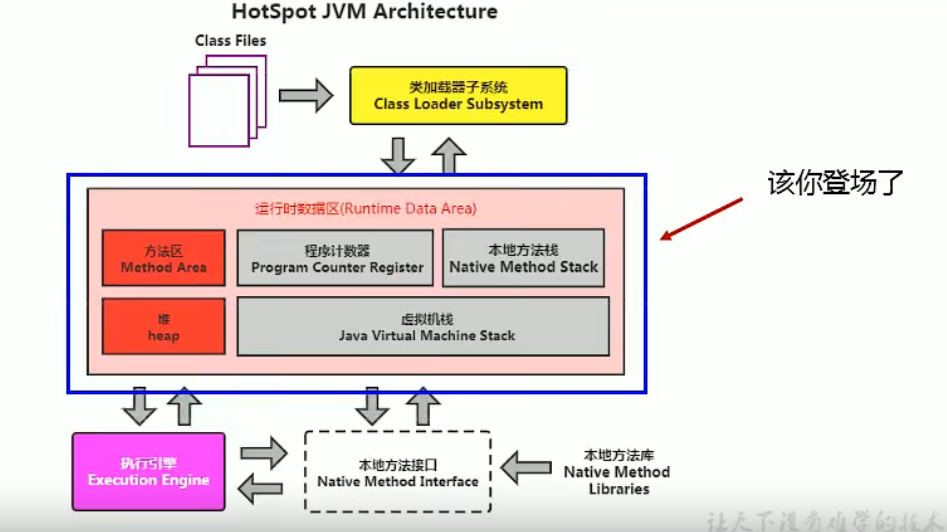

https://www.bilibili.com/video/BV1PJ411n7xZ?p=39

# 本章涉及内容

> 此图是针对于HotSpot虚拟机而言的。

# 运行时数据区概述与线程

JVM内存布局，规定了Java在运行过程中内存申请、分配、管理的策略，保证了JVM的高效稳定运行。

但不同的JVM，对于内存的划分方式和管理机制存在部分差异（方法区）。本章结合JVM虚拟机规范，对**<u>经典的JVM内存布局</u>**进行探讨。

## 运行时数据区的内部结构

运行时数据区的结构：

- 类加载器：将class文件，加载到内存中。

- 执行引擎：对<u>字节码指令</u>进行解释执行，将其翻译成<u>机器指令</u>。

- 本地方法接口、本地方法库：C/C++语言的接口或库

- 运行时数据区：可分为：

  - 由所有线程共享的数据区：随虚拟机启动而创建，随虚拟机退出而销毁：

    - 堆区
    - 堆外内存（<u>永久代,元空间（方法区）</u>、代码缓存）

    > ***永久代和元空间，可以理解为方法区的落地实现***。
    >
    > ***在JDK8之后***，方法区换名为元空间，使用的是***本地内存***

  - 线程隔离的数据区：随线程的开始和结束而创建和销毁

    - 程序计数器
    - 本地方法栈
    - 虚拟机栈

> 垃圾回收，一般是针对堆区和方法区而言的，尤其是堆区。

 

> 每个JVM，仅有一份单例的Runtime类实例。对应于运行时数据区，即运行时环境。

## 线程

- 线程是一个程序里的执行单元。JVM允许一个应用有多个线程并行执行。

- 在HotSpot JVM里，***每个线程都与操作系统的本地线程直接映射***：

  - 当一个Java线程准备好（PC、NMS、VMS、缓存分配、本地存储等）执行以后，此时一个操作系统的本地线程也同时创建。当本地线程初始化成功之后，它就会调用Java线程中的run()方法

  - 当Java线程执行终止后，本地线程会被回收

    > 当Java线程因未捕获的异常而终止时，如果此线程为最后一个非守护线程，虚拟机将退出

- 操作系统负责所有线程的安排调度，会将线程调度到任何一个可用的CPU上。

- 如果使用 jconsole 或任何一个调试工具，会发现存在许多后台线程（不包含main线程和main线程创建的线程）。这些后台系统线程，在Hotspot JVM主要是以下几个类别：

  1. 虚拟机线程：

     这种线程的操作是需要JVM达到安全点才会出现。这些操作必须在不同的线程中发生的原因是他们都需要JVM达到安全点，这样堆才不会变化。这种线程的执行类型包括“stop-the-world”的垃圾收集，线程栈收集，线程挂起以及偏向锁撤销。

  2. 周期任务线程：

     这种线程是时间周期事件的体现（比如中断），他们一般用于周期性操作的调度执行。

  3. GC线程：

     这种线程对在JVM里不同种类的垃圾收集行为提供了支持。

  4. 编译线程：

     这种线程在运行时会将字节码编译成本地代码（本地机器指令）

  5. 信号调度线程：

     这种线程接收信号并发送给JVM，在它内部通过调用适当的方法进行处理。

# PC寄存器

https://www.bilibili.com/video/BV1PJ411n7xZ?p=41