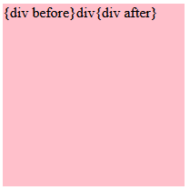

# CSS3 新增选择器

## 属性选择器

- 权重：10
- 可根据元素特定属性来选择元素。从而无需借助类或id选择器。


```html
<style>
    p[paragraph]{
        font-weight: 700;
    }
</style>

<body>
    <p paragraph="1">1111</p>
    <p>2222</p>
</body>
```


## 结构伪类选择器

- 权重：10

- 根据文档结构来选择元素。

  > 常用于：选择父级选择器里面的子元素


`nth-child(n)`：

- n可以为数字、关键字或公式

  - 数字：选择第n个元素，**数字以1开始**

  - 关键字：even偶数、odd奇数

  - 公式： n从0开始算

    ```css
    ul li:nth-child(n){...} //选择全部
    ul li:nth-child(5n){...} //选择 5，10，15，...
    ```

    

child和type的区别：

- child：

  ```html
  <style>
      section div:nth-child(1){
          background-color: red;
      }
  </style>
  
  <body>
      <section>
          <p>p</p>
          <div>div1</div> <!-- 不生效 -->
          <div>div2</div>
      </section>
  </body>
  ```

  child**会给每个子元素都编号**，`div:nth-child(1)`表示第一个子元素，且该元素为div

- type：

  ```html
  <style>
      section div:nth-of-type(1){
          background-color: red;
      }
  </style>
  
  <body>
      <section>
          <p>p</p>
          <div>div1</div> <!-- 生效 -->
          <div>div2</div>
      </section>
  </body>
  ```

  **仅给指定元素排列序号**。`div:nth-of-type(1)`表示：div元素的第一个


## 伪元素选择器

- 权重为1
- 伪元素选择器，**可以利用CSS创建标签元素，而无需HTML标签**。


- before和after创建的元素，是**行内元素**。

- 新创建元素，无法在文档树内找到。

- before和after选择器，必须设置content属性。

- 语法：`element::before{}`

  div::before{}，意味着将创建一个行内元素在div中，且为第一个子元素。


```html
<style>
    div{
        width: 200px;
        height: 200px;
        background-color: pink;
    }

    div::before{
        content: "{div before}";

    }

    div::after{
        content: "{div after}";
    }
</style>

<body>
    <div>div</div>
</body>
```




# CSS3盒子模型


盒子模型，可以通过`box-sizing`选项改变。


## 默认的盒子模型content-box

- width和height，设置的是content部分的尺寸。
- 但盒子的尺寸计算是：content+padding+border


## border-box

CSS3新引入的盒子模型：

- width和height，设置的是盒子的最终尺寸


# 图片模糊——滤镜filter

filter属性，可以将模糊或颜色偏移等图像效果应用于元素

```css
filter: 函数(); // 如 filter:blur(5px); //blur模糊处理，数值越大越模糊
```


```html
<style>
    img {
        filter: blur(5px);
    }
</style>

<body>
	
</body>
```


>[MDN Web Docs (mozilla.org)](https://developer.mozilla.org/zh-CN/)


# calc函数

calc()函数，用于在声明CSS属性值时执行一些计算。

例如：

```css
width:calc(100%-80px);
```


```html
<style>
    .outer {
        width: 300px;
        height: 200px;
        background-color: skyblue;
    }

    .inner{
        width: calc(50% - 50px);
        height: 100px;
        background-color: blueviolet;
    }
</style>


<body>
    <div class="outer">
        <div class="inner"></div>
    </div>
</body>
```


# 过渡

- 过渡（`transition`）属性，可以在不使用Flash或JS的情况下，在元素的样式变化时添加效果。
- 常和`:hover`一起使用


语法：

```css
transition: 要过渡的属性 花费时间 运动取消 延迟触发时间;
```

- 属性：想要变化的CSS属性，诸如宽度、高度、背景颜色、内外边距等。

  如果想要变化所有的属性，则写all即可

- 花费时间：必须写单位

- 运动曲线：默认为ease，可以省略

- 延迟触发时间：必须写单位。默认为0s

> 过渡写在哪里：谁做过渡给谁加


```html
<style>
    div {
        width: 200px;
        height: 100px;
        background-color: skyblue;
        
        transition: width 1s;
    }

    div:hover {
        width: 400px;
    }
</style>

<body>
    <div></div>
</body>
```


过渡多个属性：

```html
<style>
    div {
        width: 200px;
        height: 100px;
        background-color: skyblue;
        transition: width 1s,background-color 1s;
    }

    div:hover {
        width: 400px;
        background-color: slateblue;
    }
</style>
```

