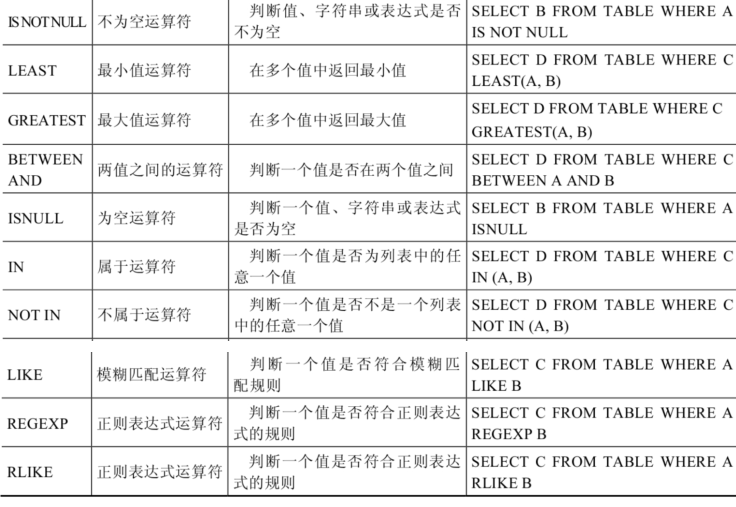

# 内容

- 基本的SELECT
- 运算符
- 排序与分页
- 多表查询
- 单行函数
- 聚合函数
- 子查询


# 数据导入指令source

```sh
mysql> source d:\mysqldb.sql
```


> 准备的数据：atguigudb.sql


# Select语句

## 语法

```sql
SELECT 标识选择哪些列
FROM 标识从哪个表中选择
```


## 列的重名

语法：

- 使用`AS`关键字，别名可以使用双引号（从而可以在别名中包含空格或特殊字符）
- AS关键字可省略，但不推荐


```sql
SELECT last_name AS name, commission_pct comm
FROM employees;
```


## 去除重复行 DISTINCT

```sql
SELECT DISTINCT department_id,salary
FROM employees;
```


注意：

- DISTINCT，是对被查询所有字段的组合、而言的去重


## NULL参与运算

- 所有与NULL进行的运算，结果都为NULL

```sql
SELECT employee_id,salary,commission_pct,
12 * salary * (1 + commission_pct) "annual_sal"
FROM employees;
```


# 运算符

[MySQL数据库教程天花板，mysql安装到mysql高级，强！硬！_哔哩哔哩_bilibili](https://www.bilibili.com/video/BV1iq4y1u7vj?p=18&vd_source=be746efb77e979ca275e4f65f2d8cda3)


## 算术运算符

算术运算符主要用于数学运算，其可以连接运算符前后的两个数值或表达式，对数值或表达式进行加（+）、减（-）、乘（*）、除（/）和取模（%）运算。  


```sql
mysql> SELECT 100, 100 + 0, 100 - 0, 100 + 50, 100 + 50 -30, 100 + 35.5, 100 - 35.5
FROM dual;
   100  100 + 0  100 - 0  100 + 50  100 + 50 -30  100 + 35.5  100 - 35.5  
------  -------  -------  --------  ------------  ----------  ------------
   100      100      100       150           120       135.5          64.5
```

> 非数字类型与数字类型进行数学运算时：
>
> - 先尝试转换为数值；若转换失败则按0算

；

## 比较运算符

比较运算符用来对表达式左边的操作数和右边的操作数进行比较，比较的结果为真则返回1，比较的结果为假则返回0，其他情况则返回NULL。  





## 逻辑运算符


## 位运算符


# 排序与分页

第五章
